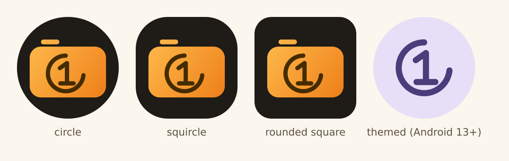

# Logo v2

Logo v1, redrawn by a script. The brand identity stays: the amber camera with a circle open to the top right around a monospace "1" with a wide foot, in dark brown. New: the amber of the camera runs into a darker orange (diagonal linear gradient, top left to bottom right).

- Source of truth: `scripts/logo/generate.mjs` (no npm dependencies). Never edit generated files by hand.
- Regenerate everything: `make logo` (Docker, `node:22-alpine` + `rsvg-convert`).
- Outputs: adaptive icon foreground and monochrome layer as VectorDrawables (`app/src/main/res/drawable/ic_launcher_*.xml`, wired in `mipmap-anydpi-v26/`), SVG masters here (`logo.svg` store icon, `foreground.svg`, `monochrome.svg`), `preview.png`, and the 512 px store icon `fastlane/metadata/android/en-US/images/icon.png`.
- Colors: amber `#FEBA4B` to orange `#EE7F1A` (camera), ink `#442C00` (circle and "1"), night `#1F1B16` (adaptive background, `values/ic_launcher_background.xml`).
- Themed icon (Android 13+): the circled "1" alone, larger, because the camera silhouette in one color would hide it.
- Safe zone: the generator fails if the mark leaves the 33 dp radius that every launcher mask keeps.
